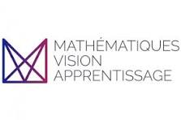

  

<h1 align="center">MVA Projects Portfolio (2024–2025)</h1>

  <b>Master Mathematics, Vision, Learning (MVA)</b> 
  ENS Paris-Saclay

---

## Overview

This repository gathers the projects, assignments, practical sessions, challenges, and research work completed during the **Master Mathematics, Vision, Learning (MVA)** at **ENS Paris-Saclay** throughout the academic year **2024–2025**.

The objective of this repository is to provide a centralized portfolio of the work carried out during the program and to illustrate the broad range of topics covered in modern Artificial Intelligence, Machine Learning, Computer Vision, and Multimodal Learning.

---

## About the MVA Program

The Master Mathematics, Vision, Learning (MVA) is one of the leading graduate programs in Artificial Intelligence, Machine Learning, Applied Mathematics, and Computer Vision.

The program combines rigorous theoretical foundations with hands-on projects and research-oriented coursework, preparing students for careers in academia and industry.

---

├── Generative_Models/
├── Research_Projects/
└── README.md
